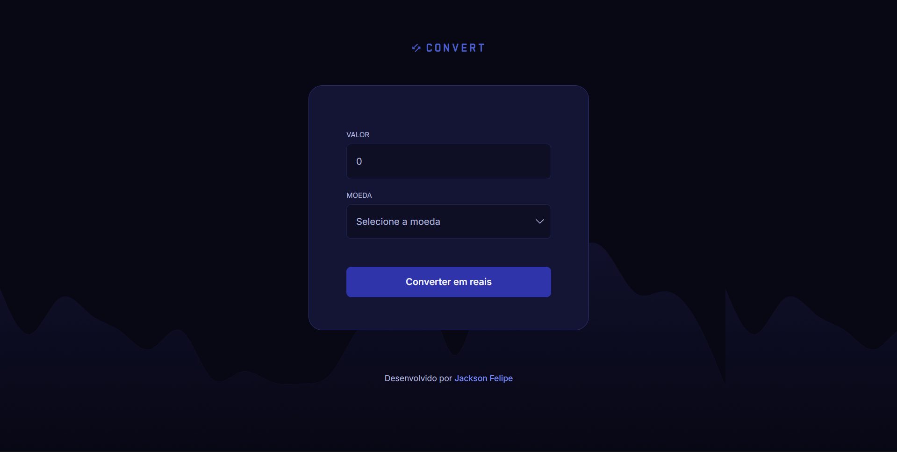

# 💱 Conversor de Moedas

<div align="center">
  
  
  <p>Conversor de moedas em tempo real com cotações atualizadas via API</p>
  
  [](https://www.linkedin.com/in/jackson-felipe-351a93301)
  
  
  
</div>

---

## 📋 Sobre o Projeto

Aplicação web para conversão de moedas estrangeiras para Real Brasileiro (BRL) com cotações atualizadas em tempo real através da API AwesomeAPI.

### ✨ Funcionalidades

- 💵 Conversão de Dólar Americano (USD) para Real
- 💶 Conversão de Euro (EUR) para Real
- 💷 Conversão de Libra Esterlina (GBP) para Real
- 🔄 Cotações atualizadas automaticamente via API
- 📱 Interface responsiva e moderna
- ✅ Validação de entrada (apenas números)

---

## 🚀 Tecnologias Utilizadas

- **HTML5** - Estrutura da aplicação
- **CSS3** - Estilização e layout responsivo
- **JavaScript (ES6+)** - Lógica e integração com API
- **AwesomeAPI** - API de cotações em tempo real

---

## 🎨 Preview

<div align="center">
  
</div>

---

## 🔧 Como Usar

1. Clone o repositório:
```bash
git clone https://github.com/Dev-JacksonFelipe/Conversor-de-Moedas.git
```

2. Navegue até a pasta do projeto:
```bash
cd Conversor-de-Moedas
```

3. Abra o arquivo `index.html` no seu navegador

---

## 📡 API Utilizada

Este projeto utiliza a [AwesomeAPI](https://docs.awesomeapi.com.br/api-de-moedas) para obter cotações em tempo real.

### Como funciona a atualização automática:

Quando a página é carregada, o JavaScript faz uma requisição para a API:

```javascript
async function fetchExchangeRates() {
  const response = await fetch('https://economia.awesomeapi.com.br/json/last/USD-BRL,EUR-BRL,GBP-BRL');
  const data = await response.json();
  
  // Atualiza os valores automaticamente
  USD = parseFloat(data.USDBRL.bid);
  EUR = parseFloat(data.EURBRL.bid);
  GBP = parseFloat(data.GBPBRL.bid);
}
```

A API retorna as cotações atualizadas de:
- **USD-BRL** (Dólar → Real)
- **EUR-BRL** (Euro → Real)
- **GBP-BRL** (Libra → Real)

Os valores são atualizados automaticamente toda vez que você recarrega a página!

---

## 💻 Estrutura do Projeto

```
Conversor-de-Moedas/
│
├── img/
│   ├── bg.png
│   ├── check.svg
│   ├── chevron-down.svg
│   ├── logo.svg
│   └── previa.png
│
├── index.html
├── scripts.js
├── styles.css
└── README.md
```

---

## 🎯 Funcionalidades Técnicas

### Validação de Input
```javascript
amount.addEventListener("input", () => {
  const hasCharactersRegex = /\D+/g;
  amount.value = amount.value.replace(hasCharactersRegex, "");
});
```

### Busca de Cotações
```javascript
async function fetchExchangeRates() {
  const response = await fetch('https://economia.awesomeapi.com.br/json/last/USD-BRL,EUR-BRL,GBP-BRL');
  const data = await response.json();
  
  USD = parseFloat(data.USDBRL.bid);
  EUR = parseFloat(data.EURBRL.bid);
  GBP = parseFloat(data.GBPBRL.bid);
}
```

---

## 📝 Licença

Este projeto está sob a licença MIT. Veja o arquivo [LICENSE](LICENSE) para mais detalhes.

---

## 👨‍💻 Desenvolvedor

  
  **Jackson Felipe**
  
  [](https://www.linkedin.com/in/jackson-felipe-351a93301)
  [](https://github.com/Dev-JacksonFelipe)
</div>

---

<div align="center">
  Feito por Jackson Felipe
</div>
